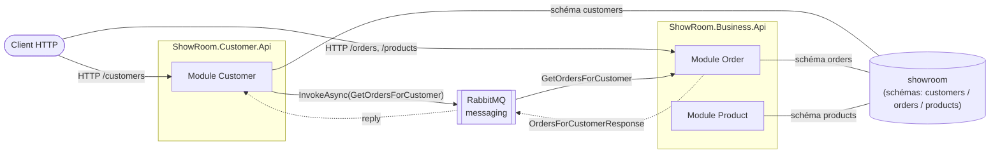

# ShowRoom

> POC .NET 10 démontrant une architecture **modulith → distribuée** : bounded contexts isolés,
> communication **machine-to-machine par messaging AMQP** (jamais HTTP), orchestration **.NET Aspire**
> et observabilité **OpenTelemetry** de bout en bout.

Le scénario métier fil rouge : **un client consulte son profil, l'historique de ses commandes et le
détail d'un produit** — chaque capacité vivant dans un bounded context distinct.

> ℹ️ **Maintenance** — ce README est la documentation racine unique du dépôt. Il doit être **tenu à
> jour en continu** : toute évolution de topologie, de service ou de contrat d'API doit s'y refléter
> (voir `.claude/rules/global.md` §3).

---

## Sommaire

- [Topologie](#topologie)
- [Stack technique](#stack-technique)
- [Principes d'architecture](#principes-darchitecture)
- [Structure de la solution](#structure-de-la-solution)
- [Démarrage](#démarrage)
- [APIs disponibles](#apis-disponibles)
- [Messaging & observabilité](#messaging--observabilité)
- [Tests](#tests)

---

## Topologie

Le système est **distribué** : le bounded context *Customer* est extrait dans son propre service, qui
dialogue avec le service *Business* (Order + Product) **uniquement via RabbitMQ** (request/reply
Wolverine). Les services partagent **une seule base PostgreSQL** (`showroom`) ; l'isolation entre
modules est assurée par **un schéma dédié par module** (`customers`, `orders`, `products`) — séparation
logique, pas physique.



- **`ShowRoom.Customer.Api`** — héberge le module Customer. **Producteur** du message : `GET
  /customers/{id}/with-orders` émet `GetOrdersForCustomer` sur le bus et attend la réponse.
- **`ShowRoom.Business.Api`** — héberge Order + Product. **Consommateur** : répond à
  `GetOrdersForCustomer` depuis sa base, sans jamais exposer d'appel HTTP interne.
- Comme le handler Order vit dans un **autre process**, la requête traverse réellement le broker →
  trace distribuée complète et fiable, sans couplage HTTP entre services.
- Dégradation gracieuse : si le service Order / le broker est indisponible, le client est tout de même
  renvoyé avec `ordersAvailable = false` et une liste de commandes vide.

---

## Stack technique

| Domaine | Choix |
|---|---|
| Runtime | .NET 10, C# / Minimal APIs (aucun MVC) |
| Orchestration | .NET Aspire (AppHost + ServiceDefaults) |
| Persistance | EF Core 10 + PostgreSQL (une base `showroom`, un schéma par module) |
| Messaging M2M | RabbitMQ via **Wolverine** (AMQP request/reply, `IMessageBus.InvokeAsync`) |
| Observabilité | OpenTelemetry (traces + métriques, export OTLP), Serilog (logs structurés) |
| Identifiants | `StronglyTypedId` (Meziantou) en interne, `PublicId` (`prefix_guid`) exposé en HTTP |
| Résultats | `Result`/`Error` + `ErrorCategory` (SmartEnum) → ProblemDetails, plutôt que des exceptions |
| Erreurs HTTP | RFC 7807 uniforme ; corps JSON malformé → `400` propre (`BadRequestExceptionHandler` + `UseExceptionHandler`), jamais de stack trace |
| Validation | FluentValidation ; devise = `Currency` **SmartEnum** ISO 4217 (`Currency.IsValidCode` au boundary, `Currency.FromCode` au domaine) |
| DI | Scrutor (scan des handlers) |
| Versioning API | Asp.Versioning (`/api/v{version}`) |
| Feature flags | Microsoft.FeatureManagement (`FeatureManagement:<Module>`) |
| Doc API | OpenAPI + Scalar (UI en développement) |
| Tests | xUnit v3, Testcontainers (PostgreSQL / RabbitMQ), ArchUnitNET, AwesomeAssertions, Bogus |

---

## Principes d'architecture

Les règles complètes font foi dans [`.claude/rules/`](.claude/rules) ; en résumé :

- **Bounded context isolé** par module (`Domain` pur ← `Persistence` ← `Features`), organisé en
  **Vertical Slice + REPR** (Request · Endpoint · Handler · Response · Assembler).
- **Pas de repository** : les handlers utilisent directement le `DbContext` du module (unité de
  travail).
- **M2M = AMQP, jamais HTTP** : un module lit les données d'un autre uniquement via son contrat de
  message `*.Contracts` sur le bus. Le HTTP est réservé au monde extérieur qui appelle le système.
- **Dual-ID** : `StronglyTypedId` technique interne + `PublicId` (préfixé, ex. `cus_`, `ord_`, `prd_`)
  seul exposé en HTTP.
- **Statuts** low-cardinality en ValueObject / SmartEnum, jamais en `string`/`int` bruts.
- **Observabilité obligatoire** : logs structurés (`BeginModuleScope`), spans enrichis
  (`SetCommonTags`), propagation du contexte de trace à travers le broker.
- **Tests obligatoires** : endpoints + assembleurs prioritaires, tests d'architecture (ArchUnit)
  gardiens des frontières.

---

## Structure de la solution

```text
Pops-ShowRoom.slnx
├─ src/
│  ├─ aspire/
│  │  ├─ ShowRoom.AppHost              # orchestration Aspire (services, PostgreSQL, RabbitMQ)
│  │  └─ ShowRoom.ServiceDefaults      # OpenTelemetry, health checks, service discovery
│  ├─ backends/
│  │  ├─ ShowRoom.Customer.Api         # service Customer (producteur messaging)
│  │  └─ ShowRoom.Business.Api         # service Order + Product (consommateur messaging)
│  ├─ modules/
│  │  ├─ ShowRoom.Modules.Customer     # bounded context Customer
│  │  ├─ ShowRoom.Modules.Order        # bounded context Order
│  │  ├─ ShowRoom.Modules.Order.Contracts   # messages AMQP partagés (contrat inter-service)
│  │  └─ ShowRoom.Modules.Product      # bounded context Product
│  ├─ buildingblocks/ShowRoom.BuildingBlocks  # primitives DDD, Result, PublicId, observabilité, pagination
│  └─ sharedkernel/ShowRoom.SharedKernel      # types partagés : VO (Email, PhoneNumber) + SmartEnum Currency (ISO 4217)
└─ tests/
   ├─ ShowRoom.Testing                        # harnais d'intégration (Testcontainers, factory générique)
   ├─ ShowRoom.Architecture.Tests             # tests de frontières (ArchUnitNET)
   └─ ShowRoom.Modules.<Module>.Tests / .IntegrationTests
```

---

## Démarrage

**Prérequis** : SDK .NET 10, Docker (PostgreSQL + RabbitMQ via Testcontainers/Aspire).

```bash
dotnet run --project src/aspire/ShowRoom.AppHost
```

Aspire démarre PostgreSQL, RabbitMQ et les deux APIs, puis ouvre le **dashboard** (traces, métriques,
logs, découverte des endpoints). Chaque service expose son UI **Scalar** (`/scalar`) en développement.

> Astuce : pour observer la trace distribuée, appeler
> `GET /api/v1/customers/{publicId}/with-orders` sur le service Customer — la trace unique traverse
> Customer.Api → RabbitMQ → Business.Api dans le dashboard.

---

## APIs disponibles

Toutes les routes sont versionnées sous `/api/v{version}` (v1 par défaut). Les ressources sont
identifiées par leur **`PublicId`** (jamais l'identifiant technique).

### ShowRoom.Customer.Api

| Verbe | Route | Description | Réponses |
|---|---|---|---|
| `POST` | `/api/v1/customers` | Crée un client | `201` + `PublicId` · `400` · `409` (email déjà utilisé) |
| `GET` | `/api/v1/customers?page=&pageSize=&search=` | Liste paginée, filtre optionnel par nom | `200` · `400` |
| `GET` | `/api/v1/customers/{publicId}` | Détail d'un client | `200` · `400` · `404` |
| `GET` | `/api/v1/customers/{publicId}/with-orders` | Client + historique de commandes (récupéré via AMQP) | `200` (avec `ordersAvailable`) · `400` · `404` |

### ShowRoom.Business.Api

**Orders**

| Verbe | Route | Description | Réponses |
|---|---|---|---|
| `POST` | `/api/v1/orders` | Crée une commande (lignes produit) | `201` + `PublicId` · `400` |
| `GET` | `/api/v1/orders/{publicId}` | Détail d'une commande + lignes | `200` · `400` · `404` |
| `GET` | `/api/v1/orders?page=&pageSize=&customerPublicId=` | Liste paginée, filtre optionnel par client | `200` · `400` |

**Products**

| Verbe | Route | Description | Réponses |
|---|---|---|---|
| `POST` | `/api/v1/products` | Crée un produit | `201` + `PublicId` · `400` |
| `GET` | `/api/v1/products/{publicId}` | Détail d'un produit | `200` · `400` · `404` |
| `GET` | `/api/v1/products?page=&pageSize=&publicId=` | Liste paginée, filtre optionnel par public id | `200` · `400` |

**Communs aux deux services** : `GET /api/status`, `GET /health` (readiness), `GET /alive`
(liveness), `/openapi` + `/scalar` (développement).

---

## Messaging & observabilité

- **Contrat** : `ShowRoom.Modules.Order.Contracts` — messages `GetOrdersForCustomer` /
  `OrdersForCustomerResponse`, records purs sans dépendance d'implémentation.
- **Producteur** (Customer.Api) : `IMessageBus.InvokeAsync<OrdersForCustomerResponse>` derrière une
  port anti-corruption (`IOrderHistory`), avec dégradation gracieuse (timeout Wolverine 5 s) et
  **retry borné sur cold-start** (3 tentatives sur `TimeoutException` — le tout premier message
  provisionne connexion + reply-queue au-delà des 5 s, les tentatives suivantes tombent sur un chemin
  chaud ; la lecture étant idempotente, le retry est sûr).
- **Consommateur** (Business.Api) : handler Wolverine écoutant la file RabbitMQ, répondant depuis
  `OrdersContext`.
- **Traces** : sources OpenTelemetry `Wolverine` + `RabbitMQ.Client.*` enregistrées ; Wolverine
  propage le contexte de trace W3C à travers le broker → une seule trace distribuée
  producteur → broker → consommateur → réponse. Chaque élément (HTTP → send → publish → deliver →
  handle → handler métier → **requêtes SQL** via l'instrumentation Npgsql) est un span avec sa
  **durée**. Métriques Wolverine (`Wolverine*`), runtime, ASP.NET Core et **Npgsql** (pool/commandes)
  exportées.
- **Logs** : Serilog structuré, enrichi `[Module] [Feature] [RequestId]`, `RequestId` dérivé du
  `TraceId` pour corréler logs et traces des deux services.

### Métriques messaging (`MessagingMetrics`) — prêtes pour un board

Meter dédié **`ShowRoom.Messaging`** (enregistré via `AddMeter` dans les deux hosts), en complément —
jamais en remplacement — des spans et des métriques Wolverine. Deux histogrammes de durée (`ms`) :

| Instrument (OTel) | Type · unité | Enregistré par | Mesure |
|---|---|---|---|
| `showroom.messaging.roundtrip.duration` | Histogram · `ms` | Producteur (Customer.Api, port `IOrderHistory`) | round-trip complet perçu par l'appelant : produce → réponse reçue (broker + réseau + traitement) |
| `showroom.messaging.handler.duration` | Histogram · `ms` | Consommateur (Business.Api, handler AMQP) | temps de traitement du message : dequeue → réponse produite |
| `showroom.messaging.retries` | Counter · `{retry}` | Producteur (Customer.Api, port) | nombre de retries request/reply (cold-start / timeouts retentés) |

**Tags** (pour `group by` / filtres dans le board) :

| Tag | Valeurs | Sur |
|---|---|---|
| `messaging.module` | `Customer`, `Order` | roundtrip · handler · retries |
| `messaging.feature` | `GetCustomerWithOrders`, `GetOrdersForCustomer` | roundtrip · handler · retries |
| `messaging.message` | `GetOrdersForCustomer` | roundtrip · retries |
| `messaging.outcome` | `success`, `failure`, `invalid_request` | roundtrip · handler |

**Panneaux type** (histogrammes OTel → en Prometheus, `.` devient `_` et l'unité est suffixée, d'où
`showroom_messaging_roundtrip_duration_milliseconds_*`) :

```promql
# Latence round-trip p95 (par feature)
histogram_quantile(0.95, sum by (le, messaging_feature) (
  rate(showroom_messaging_roundtrip_duration_milliseconds_bucket[5m])))

# Latence de transport pure ≈ round-trip − handler (p95), isole le coût AMQP du traitement métier
histogram_quantile(0.95, sum by (le) (rate(showroom_messaging_roundtrip_duration_milliseconds_bucket[5m])))
- histogram_quantile(0.95, sum by (le) (rate(showroom_messaging_handler_duration_milliseconds_bucket[5m])))

# Taux d'échec du round-trip (dégradations / timeouts non récupérés)
sum(rate(showroom_messaging_roundtrip_duration_milliseconds_count{messaging_outcome!="success"}[5m]))
/ sum(rate(showroom_messaging_roundtrip_duration_milliseconds_count[5m]))
```

Dans le **dashboard Aspire** (dev) : onglet *Metrics* → ressource → meter `ShowRoom.Messaging` ; les
durées sont aussi posées en tags de span (`customer.orders.roundtrip_ms`, `messaging.handler.duration_ms`)
visibles dans l'onglet *Traces*.

**Dashboard Grafana prêt à l'emploi** : [`docs/observability/showroom-messaging.grafana.json`](docs/observability/showroom-messaging.grafana.json)
— importable tel quel (Grafana → *Import* → choisir la datasource Prometheus). Panneaux : round-trip
p50/p95/p99, handler p50/p95/p99, latence de transport (round-trip − handler), débit par `outcome`,
taux d'échec, round-trip p95 par feature, **retries (cold-start)** ; variable `feature` pour filtrer.

### Métriques métier (Orders)

KPIs domaine (pas des timings d'infra), émis sur le **Meter de chaque module** (`ShowRoom.Modules.<Module>`,
enregistré via `AddMeter(<Module>.TelemetrySourceName)`), depuis les handlers `Create*` — pattern : Meter
de module + helper `*Metrics` co-localisé dans le slice.

| Instrument (OTel) | Module | Type | Tags | Mesure |
|---|---|---|---|---|
| `showroom.orders.created` | Order | Counter · `{order}` | `order.currency` | commandes créées (taux = commandes/s) |
| `showroom.orders.amount` | Order | Histogram | `order.currency` | total d'une commande ; `sum/count` = **panier moyen** (€), buckets = distribution |
| `showroom.orders.items` | Order | Histogram · `{item}` | — | nb d'articles/commande ; `sum/count` = **panier moyen en articles** |
| `showroom.customers.registered` | Customer | Counter · `{customer}` | — | clients inscrits (**acquisition**) |
| `showroom.<entity>.create.rejected` | Order · Product · Customer | Counter · `{rejection}` | `reason` (`validation`/`domain`/`conflict`) | créations **rejetées** — qualité du funnel |

```promql
# Panier moyen (€) par devise
sum by (order_currency) (rate(showroom_orders_amount_sum[$__rate_interval]))
/ sum by (order_currency) (rate(showroom_orders_amount_count[$__rate_interval]))

# Panier moyen en articles
sum(rate(showroom_orders_items_sum[$__rate_interval])) / sum(rate(showroom_orders_items_count[$__rate_interval]))

# Clients inscrits / minute
sum(rate(showroom_customers_registered_total[$__rate_interval])) * 60

# Rejets de création par module & raison
sum by (reason) (rate(showroom_orders_create_rejected_total[$__rate_interval]))
```

**Dashboard métier** : [`docs/observability/showroom-business.grafana.json`](docs/observability/showroom-business.grafana.json)
— commandes créées/min, panier moyen (€ et articles), distribution du montant (p50/p95), clients
inscrits/min, **rejets de création par raison** (les 3 modules), totaux sur la période ; variable `currency`.

---

## Tests

```bash
dotnet test Pops-ShowRoom.slnx
```

- **Unitaires** (`*.Tests`) : domaine, assembleurs (`To`/`From`), validateurs.
- **Intégration** (`*.IntegrationTests`) : endpoints sur un host isolé via Testcontainers PostgreSQL ;
  le harnais `ShowRoom.Testing` (`BusinessWebFactory<TEntryPoint>`) est générique et chaque suite cible
  son service.
- **Architecture** (`ShowRoom.Architecture.Tests`) : frontières entre couches et entre modules
  (un module ne dépend que du `*.Contracts` d'un autre, jamais de son implémentation).
